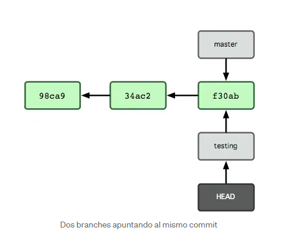

## Git básico

¿Para qué usamos Git?

En el desarollo de una aplicación, los archivos de esta pueden ser creados, modificados, renombrados, borrados y creados de nuevo. Git nos ayuda a gestionar estas modificaciones. Cin información de dónde, porqué, para qué y por quién se realizo la modificación.

En git, cada modificación de cada linea de cada archivo, queda organizada en "tiempo y espacio" y esto se relaciona con el resto de modificaciones realizadas en el historial del código.

Git se puede emplear en soledad, pero el verdadero potencial de git se hace tangible cuando desarollamos en equipo.

## Algunos conceptos básicos

### Repositorio
El repo es el lugar donde Git guarda todos los cambios realizados en toda la historia de nuestro proyecto.

Cuando clonamos un repositorio se utiliza el comando **git clone < direccion url del repo de origen >**, se realiza un a copia local del repositorio en un directorio especifíco en nuestra maquina. A medida que se modifica el repositorio local o remoto uran difiriendo entre si, es importante ir actualizando uno a otro repo a partir de nuestras propias nececidades.

Si se desea crear un nuevo repositorio nuevo se ingresa al repositorio y se ejecuta el siguiente comando para iniciar git en el repo deseado

```
$ git init
```


### Working directory
Es el estado actual de cada uno de nuestros archivos en el directorio loca. Cada modificación realizada en nuestros archivos modifican  instantáneamente este estado.

### Staging area
También conocidad como **index**, es una especie de "nebulosa" donde preparamos los cambios que serán incuidos en nuestra próxima commit.


para enviar al staging area se usa el siguiente comando dentro del repositorio en el que trabajamos

```
$ git add . 

o

$ git add *
```


### Commit
Un commit es un conjunto de cambios a uno o más archivos de nuestro repositorio. Puede ser desde una línea de código en un único archivo, hasta miles de líneas de código realizadas a cientos de archivos diferentes. Tratar de manejar commits pequeños, porque es mas facil intentar desagregar commits pequeños que grandes.

Un commit es un estado específico de nuestro código en un "tiempo y espacio " determinado. Utilizando el comando **git checkout < id del commit >** podemos viajar hacia un estado especifíco, ver cómo estaba el repo en ese estado.


Un commit es un nodo que relaciona con el resto de commits de nuestro repo a través de una línea de parentesco.

Cada commit sabe perfectamente quién es su padre (el commit desde el cual surgió), pero no sabe nada sobre sus hijos (los commits que surgieron de él). Conociendo un commit podemos averiguar sobre sus ancestro pero nada sobre su decendencia.

Usualmente un commit tiene un único padre, y es el resultado de la ejecución de us comando homónimo: **git commit**. Pero también puede tener dos padres como resultado de un ejecución de un **git merge**.
Un commit puede tener tantos hijos como nos resulte útil o necesesario.


### Branch(rama)
Una branch es, en principio, ni más ni menos que un puntero a un commit.
En nuestro repo podemos tener branches como nos resute util y son miltiples.
Suele ser util utilizar una branch por tarea de desarollo y, al finalizar la tarea, crear un PR en github.

### Pull Request(PR)
Solicitud de incorporación de cambios desde una branch a otra. Se trata de una instancia sumamente rica del desarollo de sofware en equipo. En el contexto de un PR, los cambios pusheados en una branch determinada son revisados, discutidos ignorados, aprobados, ignorados o rechazados.
Al final del día y luego de modificaciones, usualmente termian en: mergeados en la branch solicitada o descartados.

### Master 

Es la branch default de cada repo, es  la branch de referencia. Que implica: cuando clonamos un repositorio, estamos parados en master; a master apuntan por default los PRs de Github.

Suele representar un estado estable del proyecto. Cada cambio que llega allí, generalmente es porque se aprobo por quien esta a cargo del proyecto.

### HEAD

Existe un puntero especial que nos acompaña en todo momento: **HEAD**. Determina en que "tiempo y espacio ", específico  de nuestro repo nos encontramos. En el repo de origen, suele apuntar a master durante todo el ciclo de vida del repositorio.

En el repo local,  es útil apuntarlo temporalmente a un commit específico, para viajar en "tiempo y espacio" y ver cuál es el estado del código en ese punto particular de la historia, pero normalmente queremos que esté apuntando a la branch sobre la que estamos trabajando.

El comando para modificar hacia donde apunta el HEAD es **git checkout < nombre del branch >** o **git checkout < id del commit >**.

### Algunos comandos útiles.

**git checkout -b < nombre del brach a crear >** crea una branch nueva que apunta al commit en el que estoy parado.

Se realiza esta operación mientras HEAD se encuantra apuntando a branch. Luego de correr este comando, se tiene la nueva branch apuntando al mismo commit que la branch donde me encontraba. Pero HEAD va a quedar apuntando a la branch recientemente creada.



**git commit** aplica sobre la branch a la que HEAD se encuentra apuntando al momento de ser ejecutado. En este caso, si no modifico nada más, mis commits subsiguientes van a ser aplicados sobre esta nueva branch.

**git commit -m < mensaje >** El mensaje del commit es obligatorio. ¿Qué sentido tendría aplicar un cambio si no tenés claro el motivo por el que los estás haciendo? tu yo del presente y futuro te lo agradeceran, te debes acostrumbrar a explicar el porqué estas haciendo lo que estás haciendo.

**git commit --amend** nos permite retocar el commit sobre el cual estas parado, se puede rescribir el mensaje, para sumar o quitar un cambio.

Si el commit que estoy retocando ya fue pusheado, git no va adejar sobre escribirlo, en esote caso para sobrescribir de forma remota, se ejecuta **git push origin < nombre de la branch > --force-with-lease**, se debe tener cuidado coneste comando se puede perder el propio trabajo o el trabajo ajeno.

**git push origin < nombre del branch >** actualiza la branch del repo de origen con los cambios de mi branch local.

**git fetch** descarga en mi repo local todos los cambios que se hayan producido en el repo de origem desde la última sincronización, pero no realiza combio sobre mi branches locales.

**git pull origin < nombre del la branch >** actualiza mi branch local cambios que ese branch haya sufrido cambios en el repo de origen.  
En caso de existir conflictos porque se realizaron cambios en simultáneo en el repo de origen y en mi repo local, tendrpe que resolverlo antes de poser actualizar mi branch local con este comando.

En el caso de querer descartar los cambios en mi repo local, puedo ejecutar **git reset --hard origin/< nombre del branch >** 

**git reset < nombre del branch >** o **git reset < id del commit >** apunta mi branch actual al commit que le estoy indicando.

El comando **git reset** es útil, pero también es riesgoso. EL riesgo de utilizarlo sin recaudos necesarios es perder trabajo realizado en la branch actual.


### Más información en:

https://bluuweb.dev/03-git/03-git-intermedio.html